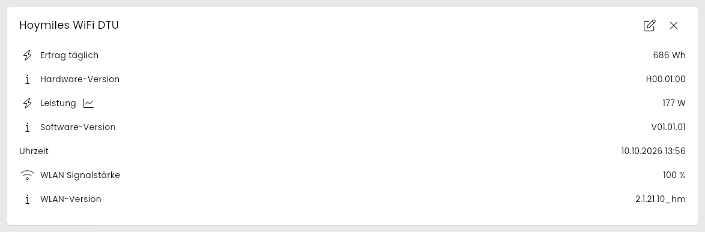
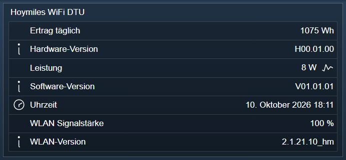

[](https://www.symcon.de/service/dokumentation/entwicklerbereich/sdk-tools/sdk-php/)
[](https://community.symcon.de/t/modul-hoymiles-wifi-series-beta/135536/)
[](https://www.symcon.de/de/service/dokumentation/installation/migrationen/v80-v81-q3-2025/)  
[](#10-lizenz)
[](https://github.com/Nall-chan/HoymilesWiFi/actions)
[](https://github.com/Nall-chan/HoymilesWiFi/actions)  
[](#2-spenden)
[](#2-spenden)  

# Hoymiles WiFi DTU <!-- omit in toc -->

Darstellen der ausgelesenen Werte aus der DTU

## Inhaltsverzeichnis <!-- omit in toc -->

- [1. Funktionsumfang](#1-funktionsumfang)
- [2. Voraussetzungen](#2-voraussetzungen)
- [3. Software-Installation](#3-software-installation)
- [4. Einrichten der Instanzen in IP-Symcon](#4-einrichten-der-instanzen-in-ip-symcon)
- [5. Statusvariablen](#5-statusvariablen)
  - [Statusvariablen](#statusvariablen)
- [6. Visualisierung](#6-visualisierung)
  - [Kachel Visualisierung](#kachel-visualisierung)
  - [WebFront Visualisierung](#webfront-visualisierung)
- [7. PHP-Befehlsreferenz](#7-php-befehlsreferenz)
- [8. Aktionen](#8-aktionen)
- [9. Anhang](#9-anhang)
  - [1. Changelog](#1-changelog)
  - [2. Spenden](#2-spenden)
- [10. Lizenz](#10-lizenz)

## 1. Funktionsumfang

- Anzeigen der Werte der DTU

## 2. Voraussetzungen

- Symcon ab Version 8.1  
- Hoymiles Wechselrichter mit WiFi (integrierte DTU)

## 3. Software-Installation

Dieses Modul ist Bestandteil der [Hoymiles WiFi-Library](../README.md#3-software-installation).  

## 4. Einrichten der Instanzen in IP-Symcon

Unter 'Instanz hinzufügen' kann das 'Hoymiles WiFi DTU'-Modul mithilfe des Schnellfilters gefunden werden.  
Weitere Informationen zum Hinzufügen von Instanzen in der [Dokumentation der Instanzen](https://www.symcon.de/service/dokumentation/konzepte/instanzen/#Instanz_hinzufügen)

Es wird empfohlen diese Instanz über die dazugehörige Instanz des [Configurator-Moduls](../HoymilesWiFi%20Configurator/README.md) anzulegen.  

  

## 5. Statusvariablen

Die Statusvariablen werden automatisch angelegt. Das Löschen einzelner kann zu Fehlfunktionen führen.

### Statusvariablen

| Name              | Typ     | Beschreibung                                 |
| ----------------- | ------- | -------------------------------------------- |
| Uhrzeit           | Integer | Uhrzeit der DTU                              |
| Leistung          | Float   | Aktuelle Leistung                            |
| Ertrag täglich    | Float   | Tagesertrag                                  |
| WLAN Signalstärke | Integer | Signalstärke des WLAN in Prozent             |
| Software-Version  | String  | Firmware der DTU (z.B. `V00.01.11`)          |
| Hardware-Version  | String  | Hardware der DTU (z.B. `H00.01.00`)          |
| WLAN-Version      | String  | Version des WLAN-Moduls (z.B. `2.1.21.4_hm`) |

Signalstärke und Versionen werden nach dem Start der IO-Instanz und danach alle 5 Minuten abgefragt.  

## 6. Visualisierung

### Kachel Visualisierung

Die Instanz wird als Liste ihrer Statusvariablen dargestellt.  

  

### WebFront Visualisierung

Die Statusvariablen werden direkt oder über Links dargestellt. Es gibt keine bedienbaren Statusvariablen.  

  

## 7. PHP-Befehlsreferenz

```php
bool HMSWIFI_RebootDTU(integer $InstanzID);
```

Startet die DTU neu.  
Liefert `true`, wenn der Befehl gesendet wurde. Die DTU bestätigt den Befehl nicht immer, sondern startet sofort neu. Während des Neustarts ist die DTU kurzzeitig nicht erreichbar und das IO geht in einen Fehlerzustand, bis wieder Daten kommen.  
In der Instanz-Konfiguration steht dafür die Schaltfläche `DTU neu starten` zur Verfügung.  

> [!NOTE]
> Mit DTU-Firmware V01.01.01 und Inverter-Firmware V01.03.09 blieb dieser Befehl im Test ohne Wirkung (die DTU war durchgehend erreichbar). Mit DTU-Firmware V00.01.11 startete er die DTU. Das Verhalten wird noch untersucht.

```php
HMSWIFI_RebootDTU(12345);
```

## 8. Aktionen

**Grundsätzlich können alle bedienbaren Statusvariablen als Ziel einer [`Aktion`](https://www.symcon.de/service/dokumentation/konzepte/automationen/ablaufplaene/aktionen/) mit `Auf Wert schalten` angesteuert werden, so dass hier keine speziellen Aktionen benutzt werden müssen.**

Für dieses Modul gibt es keine speziellen Aktionen.  

## 9. Anhang

### 1. Changelog

siehe Changelog der [Hoymiles WiFi-Library](../README.md#2-changelog).  

### 2. Spenden  
  
Die Library ist für die nicht kommerzielle Nutzung kostenlos, Schenkungen als Unterstützung für den Autor werden hier akzeptiert:  

[](https://paypal.me/Nall4chan)  

[](https://www.amazon.de/hz/wishlist/ls/YU4AI9AQT9F?ref_=wl_share)

## 10. Lizenz

IPS-Modul:  
[Custom NC-SA](../LICENSE)
