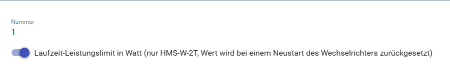
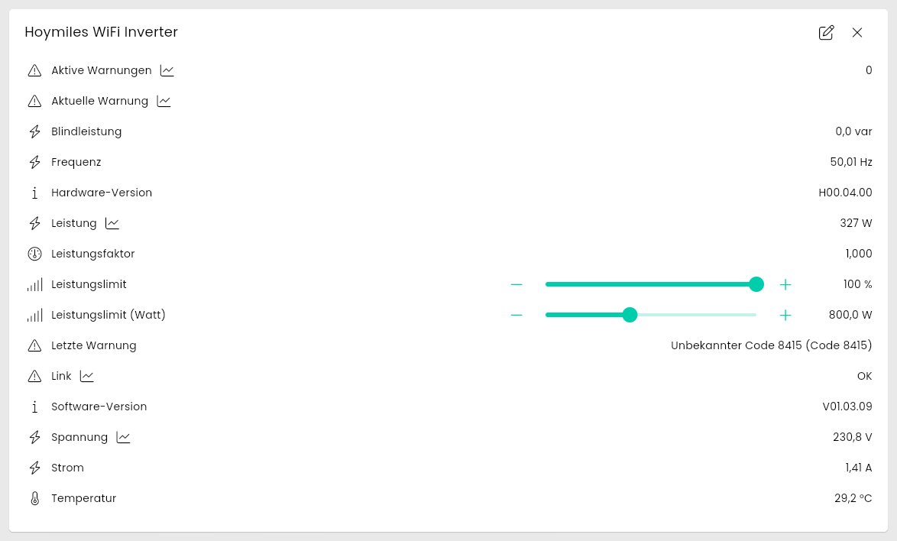
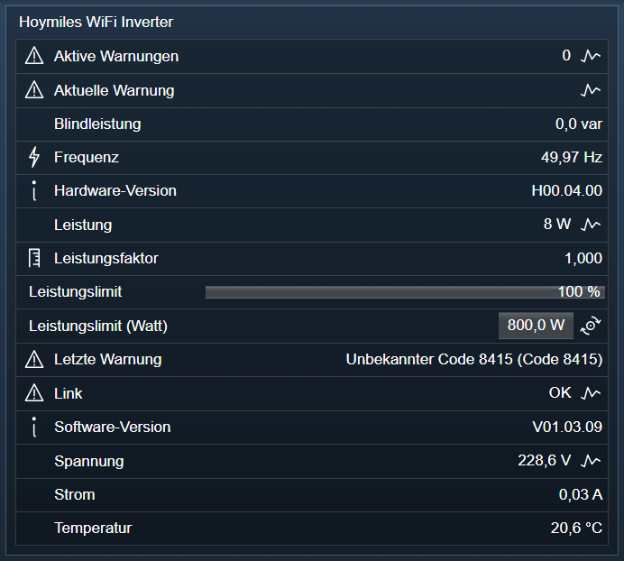

[](https://www.symcon.de/service/dokumentation/entwicklerbereich/sdk-tools/sdk-php/)
[](https://community.symcon.de/t/modul-hoymiles-wifi-series-beta/135536/)
[](https://www.symcon.de/de/service/dokumentation/installation/migrationen/v80-v81-q3-2025/)  
[](#10-lizenz)
[](https://github.com/Nall-chan/HoymilesWiFi/actions)
[](https://github.com/Nall-chan/HoymilesWiFi/actions)  
[](#2-spenden)
[](#2-spenden)  

# Hoymiles WiFi Inverter <!-- omit in toc -->

Anzeigen und Steuern der Werte des Inverters

## Inhaltsverzeichnis <!-- omit in toc -->

- [1. Funktionsumfang](#1-funktionsumfang)
- [2. Voraussetzungen](#2-voraussetzungen)
- [3. Software-Installation](#3-software-installation)
- [4. Einrichten der Instanzen in IP-Symcon](#4-einrichten-der-instanzen-in-ip-symcon)
- [5. Statusvariablen](#5-statusvariablen)
  - [Statusvariablen](#statusvariablen)
- [6. Visualisierung](#6-visualisierung)
  - [Kachel Visualisierung](#kachel-visualisierung)
  - [WebFront Visualisierung](#webfront-visualisierung)
- [7. PHP-Befehlsreferenz](#7-php-befehlsreferenz)
- [8. Aktionen](#8-aktionen)
- [9. Anhang](#9-anhang)
  - [1. Changelog](#1-changelog)
  - [2. Spenden](#2-spenden)
- [10. Lizenz](#10-lizenz)

## 1. Funktionsumfang

- Anzeigen der Werte des Inverters
- Setzen des Leistungslimit in Prozent (dauerhaft gespeichert)
- Setzen eines Laufzeit-Leistungslimit in Watt (nur HMS-W-2T-Familie, wird bei einem Neustart des Wechselrichters zurückgesetzt)

## 2. Voraussetzungen

- IP-Symcon ab Version 8.1
- Hoymiles Wechselrichter mit WiFi (integrierte DTU)
  
## 3. Software-Installation

Dieses Modul ist Bestandteil der [Hoymiles WiFi-Library](../README.md#3-software-installation).  

## 4. Einrichten der Instanzen in IP-Symcon

Unter 'Instanz hinzufügen' kann das 'Hoymiles WiFi Inverter'-Modul mithilfe des Schnellfilters gefunden werden.  
Weitere Informationen zum Hinzufügen von Instanzen in der [Dokumentation der Instanzen](https://www.symcon.de/service/dokumentation/konzepte/instanzen/#Instanz_hinzufügen)

Es wird empfohlen diese Instanz über die dazugehörige Instanz des [Configurator-Moduls](../HoymilesWiFi%20Configurator/README.md) anzulegen.  

  

**Konfigurationsseite**:  

| Eigenschaft                                                       | Name                 | Typ     | Standardwert | Beschreibung                                                                                     |
| ----------------------------------------------------------------- | -------------------- | ------- | :----------: | ------------------------------------------------------------------------------------------------ |
| Nummer                                                            | Number               | integer |      1       | Adresse des Inverters (1 bis 3)                                                                  |
| Laufzeit-Leistungslimit in Watt (nur HMS-W-2T, Wert wird bei einem Neustart des Wechselrichters zurückgesetzt) | EnablePowerLimitWatt | bool    |    false     | Legt die Statusvariable `Leistungslimit (Watt)` an, siehe [`HMSWIFI_SetPowerLimitWatt`](#7-php-befehlsreferenz) |

```php
IPS_SetProperty(12345, 'EnablePowerLimitWatt', true);
IPS_ApplyChanges(12345);
```

  

## 5. Statusvariablen

Die Statusvariablen werden automatisch angelegt. Das Löschen einzelner kann zu Fehlfunktionen führen.

### Statusvariablen

| Name             | Typ     | Beschreibung                              |
| ---------------- | ------- | ----------------------------------------- |
| Spannung         | float   | Spannung Ausgangsseite                    |
| Frequenz         | float   | Frequenz Ausgangsseite                    |
| Leistung         | float   | Abgegeben Leistung                        |
| Strom            | float   | Strom Ausgangsseite                       |
| Leistungsfaktor  | float   | Leistungsfaktor cos φ (z.B. `0,950`)      |
| Temperatur       | float   | Temperatur des Inverters                  |
| Link             | bool    | Inverter mit DTU verbunden                |
| Leistungslimit   | integer | Einstellbares Limit des Inverters in %    |
| Leistungslimit (Watt) | float | Laufzeit-Limit in W (nur wenn in der Konfiguration aktiviert), Maximum des Schiebereglers ist die Nennleistung des Inverters (sonst 2000 W) |
| Blindleistung    | float   | Blindleistung Ausgangsseite (var)         |
| Aktive Warnungen | integer | Anzahl der aktuell aktiven Warnungen      |
| Aktuelle Warnung | string  | Texte der aktiven Warnungen               |
| Letzte Warnung   | string  | Text und Code der letzten Warnung         |
| Software-Version | string  | Firmware des Inverters (z.B. `V01.00.08`) |
| Hardware-Version | string  | Hardware des Inverters (z.B. `H00.04.00`) |

Software- und Hardware-Version werden nach dem Start der IO-Instanz und danach alle 5 Minuten abgefragt.  
Die DTU aktualisiert ihre Warnliste bei neuen Warn-Ereignissen, sonst höchstens alle 30 Minuten. Eine in der App bereits beendete Warnung kann daher hier bis zu 30 Minuten länger als aktiv angezeigt werden. Die Liste wird erst ab DTU-Firmware V01.01.01 geliefert (siehe [Firmware der DTU](../README.md#firmware-der-dtu)).  
Die DTU meldet das Leistungslimit erst, nachdem es seit dem letzten Start des Inverters einmal gesetzt wurde (aus Symcon oder aus der App). Bis dahin bleibt der letzte bekannte Wert erhalten.  
Die DTU meldet immer nur das zuletzt gesetzte Limit, also entweder in % oder in Watt. Die Instanz merkt sich, welches zuletzt aus Symcon gesetzt wurde, und aktualisiert die passende Variable. Meldet die DTU einen anderen Wert, wurde das Limit außerhalb von Symcon geändert (z.B. in der App, die immer ein Limit in % setzt); der Wert wird dann als % übernommen.  
Ein Limit in % und ein Neustart des Inverters heben ein Limit in Watt auf. Umgekehrt ersetzt ein Limit in Watt das Limit in % bis zum nächsten Neustart, auch wenn es höher ist; `Leistungslimit` zeigt währenddessen weiter das gespeicherte Limit in %, das nach dem Neustart wieder gilt. `Leistungslimit (Watt)` zeigt dann die Nennleistung des Inverters an (keine Begrenzung in Watt; ist die Nennleistung unbekannt, 2000 W). Den Neustart erkennt die Instanz daran, dass der Tagesertrag wieder bei 0 beginnt.  
Die beiden Einstellungen für das Leistungslimit in der Hoymiles-App (unter „System“ und in den Geräteeinstellungen) speichert die App getrennt. Am Inverter gilt nur ein Limit in %: der zuletzt gesendete Wert, egal aus welchem Feld.  

## 6. Visualisierung

### Kachel Visualisierung

Die Instanz wird als Liste ihrer Statusvariablen dargestellt. `Leistungslimit` und `Leistungslimit (Watt)` sind über Schieberegler bedienbar.  

  

### WebFront Visualisierung

Die Statusvariablen werden direkt oder über Links dargestellt. `Leistungslimit` und `Leistungslimit (Watt)` sind bedienbar.  

  

## 7. PHP-Befehlsreferenz

```php
bool HMSWIFI_SetPowerLimit(integer $InstanzID, int $Limit);
```

Setzen des Leistungslimit des Inverters.  
Der neue Wert in `$Limit` ist in Prozent anzugeben (2 bis 100).  
Das Limit wird dauerhaft gespeichert und gilt auch nach einem Neustart des Inverters. Ein aktives Limit in Watt (`HMSWIFI_SetPowerLimitWatt`) wird damit aufgehoben.  

> [!CAUTION]
> Jedes Setzen beschreibt den Flash-Speicher der DTU und den EEPROM des Wechselrichters. Diese Speicher vertragen nur eine begrenzte Anzahl Schreibvorgänge, zu häufiges Setzen kann DTU und Wechselrichter dauerhaft beschädigen.  
> Das Limit daher nicht in kurzen Abständen ändern (z.B. für eine Nulleinspeisung). Dafür ist `HMSWIFI_SetPowerLimitWatt` gedacht.

```php
HMSWIFI_SetPowerLimit(12345, 80); // Limit 80 %
```

---

```php
bool HMSWIFI_SetPowerLimitWatt(integer $InstanzID, float $Watt);
```

Setzen eines Laufzeit-Leistungslimit.  
Der neue Wert in `$Watt` ist in Watt anzugeben (0.1 bis 3276.7), nicht in Prozent.  
Nur für Inverter der HMS-W-2T-Familie (mit integrierter DTU, z.B. HMS-800W-2T).  
Das Limit liegt nur im Arbeitsspeicher von DTU und Inverter, es wird nichts in Flash oder EEPROM geschrieben. Daher eignet es sich für häufige Änderungen, z.B. eine Nulleinspeisung.  
Es gilt immer der zuletzt gesendete Befehl: Ein Limit in Watt ersetzt das Limit in Prozent, auch wenn es höher ist (z.B. 800 W bei 20 % eines HMS-800W-2T ergibt volle Leistung).  
Beim Neustart des Inverters (spätestens jede Nacht) geht es verloren, danach gilt wieder das gespeicherte Limit in Prozent. Das Modul sendet es nicht erneut.  
Liefert `true`, wenn die DTU den Befehl bestätigt hat.  
Die Statusvariable `Leistungslimit (Watt)` wird nur angelegt, wenn sie in der [Konfiguration](#4-einrichten-der-instanzen-in-ip-symcon) aktiviert ist; die Funktion arbeitet auch ohne sie.  

```php
HMSWIFI_SetPowerLimitWatt(12345, 300); // Limit 300 W
```

Um die Begrenzung aufzuheben, die Nennleistung des Inverters setzen (z.B. `HMSWIFI_SetPowerLimitWatt(12345, 800)` bei einem HMS-800W-2T, siehe `RatedPower` in [`HMSWIFI_GetDeviceInfo`](../HoymilesWiFi%20IO/README.md#7-php-befehlsreferenz)). Das schreibt ebenfalls nichts in Flash oder EEPROM. Für eine Regelung mit `HMSWIFI_SetPowerLimitWatt` sollte das Limit in Prozent auf 100 stehen, sonst begrenzt es nach jedem Neustart, bis wieder ein Wert in Watt gesendet wird.  
Ein Limit in Prozent (`HMSWIFI_SetPowerLimit`) und ein Neustart des Inverters heben das Limit in Watt ebenfalls auf.  

Die Funktion und die Werte stammen aus dem Projekt [ioBroker.hoymiles](https://github.com/Eistee82/ioBroker.hoymiles) (MIT-Lizenz) und wurden mit einem HMS-W-2T (DTU-Firmware V01.01.01) geprüft: Ein Limit von 30 W senkte die Leistung von 93 W auf 27 W, ein Limit von 100 % hob es wieder auf.  

---

```php
bool HMSWIFI_SetInverterState(integer $InstanzID, bool $State);
```

Ein (`true`) oder ausschalten (`false`) des Inverters über den Parameter `State`.  

---

```php
bool HMSWIFI_RebootInverter(integer $InstanzID);
```

Startet den Inverter neu.  
Liefert `true`, wenn der Befehl gesendet wurde. Die DTU bestätigt den Befehl nicht immer, das IO geht dann kurz in einen Fehlerzustand, bis wieder Daten kommen. Die IO-Instanz muss nach ihrem Start mindestens einmal erfolgreich Daten abgerufen haben, damit die Seriennummer des Inverters bekannt ist.  
Nach dem Neustart beginnt der Tagesertrag wieder bei 0.  
In der Instanz-Konfiguration steht dafür die Schaltfläche `Wechselrichter neu starten` zur Verfügung.  

> [!NOTE]
> Mit DTU-Firmware V01.01.01 und Inverter-Firmware V01.03.09 startete dieser Befehl im Test nicht den Inverter (der Tagesertrag lief weiter), sondern die DTU war etwa 20 Sekunden nicht erreichbar. Mit älterer Firmware startete er den Inverter. Das Verhalten wird noch untersucht.

```php
HMSWIFI_RebootInverter(12345);
```

---

```php
array HMSWIFI_GetWarnings(integer $InstanzID);
```

Liefert die zuletzt von der DTU gelesene Warnliste des Inverters.  
Jeder Eintrag enthält `Code`, `Text`, `Number`, `StartTime`, `EndTime` (0 = noch aktiv), `Active`, `Data1` und `Data2`.  
Die Klartexte der Warncodes stammen aus dem Projekt [ioBroker.hoymiles](https://github.com/Eistee82/ioBroker.hoymiles) (MIT-Lizenz).  

```php
print_r(HMSWIFI_GetWarnings(12345));
```

## 8. Aktionen

**Grundsätzlich können alle bedienbaren Statusvariablen als Ziel einer [`Aktion`](https://www.symcon.de/service/dokumentation/konzepte/automationen/ablaufplaene/aktionen/) mit `Auf Wert schalten` angesteuert werden, so dass hier keine speziellen Aktionen benutzt werden müssen.**

Für dieses Modul gibt es keine speziellen Aktionen.  

> [!CAUTION]
> `Leistungslimit` beschreibt bei jeder Änderung den Flash-Speicher (siehe [`HMSWIFI_SetPowerLimit`](#7-php-befehlsreferenz)). Für häufige Änderungen aus Ablaufplänen oder Ereignissen `Leistungslimit (Watt)` verwenden.

## 9. Anhang

### 1. Changelog

siehe Changelog der [Hoymiles WiFi-Library](../README.md#2-changelog).  

### 2. Spenden  
  
Die Library ist für die nicht kommerzielle Nutzung kostenlos, Schenkungen als Unterstützung für den Autor werden hier akzeptiert:  

[](https://paypal.me/Nall4chan)  

[](https://www.amazon.de/hz/wishlist/ls/YU4AI9AQT9F?ref_=wl_share)

## 10. Lizenz

IPS-Modul:  
[Custom NC-SA](../LICENSE)
