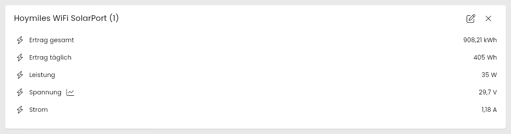
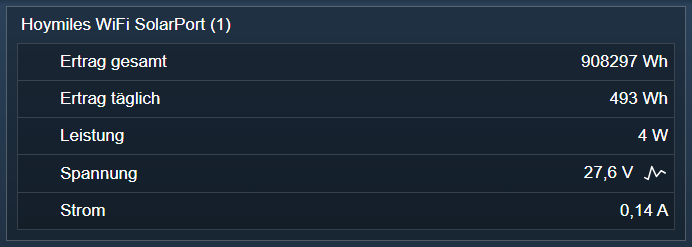

  

  

  

# Hoymiles WiFi SolarPort <!-- omit in toc -->

Anzeigen der Werte eines Solar Anschlusses.

## Inhaltsverzeichnis <!-- omit in toc -->

- [1. Funktionsumfang](#1-funktionsumfang)
- [2. Voraussetzungen](#2-voraussetzungen)
- [3. Software-Installation](#3-software-installation)
- [4. Einrichten der Instanzen in IP-Symcon](#4-einrichten-der-instanzen-in-ip-symcon)
- [5. Statusvariablen](#5-statusvariablen)
  - [Statusvariablen](#statusvariablen)
- [6. Visualisierung](#6-visualisierung)
  - [Kachel Visualisierung](#kachel-visualisierung)
  - [WebFront Visualisierung](#webfront-visualisierung)
- [7. PHP-Befehlsreferenz](#7-php-befehlsreferenz)
- [8. Aktionen](#8-aktionen)
- [9. Anhang](#9-anhang)
  - [1. Changelog](#1-changelog)
  - [2. Spenden](#2-spenden)
- [10. Lizenz](#10-lizenz)

## 1. Funktionsumfang

- Anzeigen der Werte eines Solar Anschlusses.

## 2. Voraussetzungen

- Symcon ab Version 8.1  
- Hoymiles Wechselrichter mit WiFi (integrierte DTU)

## 3. Software-Installation

Dieses Modul ist Bestandteil der [Hoymiles WiFi-Library](../README.md#3-software-installation).  

## 4. Einrichten der Instanzen in IP-Symcon

Unter 'Instanz hinzufügen' kann das 'Hoymiles WiFi SolarPort'-Modul mithilfe des Schnellfilters gefunden werden.  
Weitere Informationen zum Hinzufügen von Instanzen in der [Dokumentation der Instanzen](https://www.symcon.de/service/dokumentation/konzepte/instanzen/#Instanz_hinzufügen)

Es wird empfohlen diese Instanz über die dazugehörige Instanz des [Configurator-Moduls](../HoymilesWiFi%20Configurator/README.md) anzulegen.  

  

**Konfigurationsseite:**  

| Name | Typ     | Standardwert | Beschreibung           |
| ---- | ------- | :----------: | ---------------------- |
| Port | integer |      1       | Nummer des Anschlusses |

  

## 5. Statusvariablen

Die Statusvariablen werden automatisch angelegt. Das Löschen einzelner kann zu Fehlfunktionen führen.

### Statusvariablen

| Name             | Typ   | Beschreibung                                      |
| ---------------- | ----- | ------------------------------------------------- |
| Spannung         | float | Anliegende Spannung am Anschluss                  |
| Strom            | float | Ankommender Strom                                 |
| Leistung         | float | Aktuelle Leistung der angeschlossene Solar-Module |
| Ertrag gesamt    | float | Gesamtertrag des Anschlusses in kWh               |
| Ertrag täglich   | float | Tagesertrag des Anschlusses in Wh                 |

Bis Version 1.25 hießen `Ertrag gesamt` und `Ertrag täglich` `Leistung gesamt` und `Leistung täglich`. Bestehende Statusvariablen behalten ihren Namen.  

## 6. Visualisierung

### Kachel Visualisierung

Die Instanz wird als Liste ihrer Statusvariablen dargestellt.  

  

### WebFront Visualisierung

Die Statusvariablen werden direkt oder über Links dargestellt. Es gibt keine bedienbaren Statusvariablen.  

  

## 7. PHP-Befehlsreferenz

   Es existieren keine PHP-Befehle für dieses Modul.  

## 8. Aktionen

**Grundsätzlich können alle bedienbaren Statusvariablen als Ziel einer [`Aktion`](https://www.symcon.de/service/dokumentation/konzepte/automationen/ablaufplaene/aktionen/) mit `Auf Wert schalten` angesteuert werden, so dass hier keine speziellen Aktionen benutzt werden müssen.**

Für dieses Modul gibt es keine speziellen Aktionen.  

## 9. Anhang

### 1. Changelog

siehe Changelog der [Hoymiles WiFi-Library](../README.md#2-changelog).  

### 2. Spenden  
  
  Die Library ist für die nicht kommerzielle Nutzung kostenlos, Schenkungen als Unterstützung für den Autor werden hier akzeptiert:  

  

## 10. Lizenz

IPS-Modul:  
[Custom NC-SA](../LICENSE)
